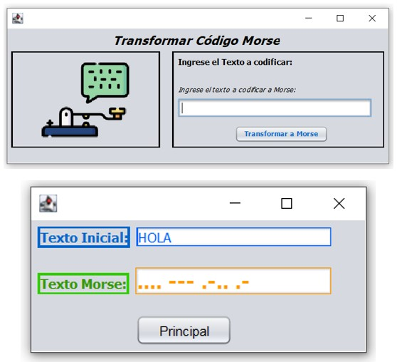

# MorseTranslator
GUI para transformar cadenas de caractéres a Código Morse - GUI to transform character strings to Morse Code.

En este ejemplo se presenta una interfaz gráfica donde se ingresa una cadena de caracteres y cuando se pasa el mouse sobre el boton de procesar, se presenta la cadena convertida a código morse.

This example shows a graphical interface where a string of characters is entered and when the mouse is passed over the process button, the string converted to Morse code is displayed.

